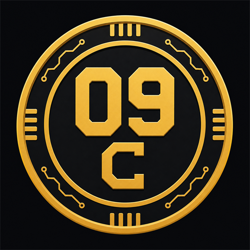

# Bitcoin 09 (09C)



Fair-launch CPU proof of work: 21M cap, 10 minute blocks, no premine,
Argon2id mining.

Bitcoin 09 keeps Bitcoin's supply and reward shape but uses Argon2id instead
of SHA-256 for proof of work. Normal CPUs can mine it, and the 64 MiB memory
cost is meant to reduce the easy ASIC/GPU advantage that took over Bitcoin.

```text
site:     https://btc09.org
explorer: https://explorer.btc09.org
discord:  https://discord.gg/fUuGzwRTzP
release:  https://github.com/krutftw/bitcoin09/releases/latest
privacy:  https://btc09.org/privacy.html
terms:    https://btc09.org/terms.html
```

[Code signing policy](CODE_SIGNING.md) / [Direct-download status](docs/DIRECT-DOWNLOADS.md)

| | Bitcoin | Bitcoin 09 |
|---|---|---|
| Supply cap | 21,000,000 | 21,000,000 |
| Block reward | 50, halves every 210,000 blocks | 50, halves every 210,000 blocks |
| Block time | 10 minutes | 10 minutes |
| Premine | none | none |
| Genesis reward | unspendable | unspendable |
| Proof of work | SHA-256d (ASICs) | Argon2id 64 MiB (CPU-accessible) |
| Signatures | ECDSA/Schnorr | Ed25519 |

## Read this first

09C is worth nothing. Bitcoin was worth nothing in 2009 too, that's the
whole idea here. No premine, no company, no allocation. The genesis reward is
burned to an address nobody can spend from, so every coin that will ever
exist gets mined publicly starting at block 1. Mine it because it's fun and
you missed 2009. Don't put in money you care about, and don't expect any
back.

## Quick start

### Native wallet app

For everyday receiving and sending, use the installed BTC09 Wallet app. It
runs in its own window and does not open a browser tab or download the full
chain. Native downloads are available for Windows, macOS, Android, and Linux:

<https://btc09.org/#download>

Android is project-signed and Linux is available as an AppImage. Windows and
macOS are installable community builds but are not publisher-signed or
Apple-notarized, so the operating system warns on first launch. Each release
publishes checksums.

### Full client, node, and CPU miner

The full BTC09 binary includes the wallet, node, and official CPU miner.
Running it without a command starts its local interface in your browser:

```powershell
.\btc09-windows-amd64.exe
```

You can also start it explicitly with `btc09 app`. Use the full client when
you want to mine, run a node, or use command-line tools. New wallets use a 24-word
recovery phrase and an Argon2id-encrypted local file. The app asks for the
password again after restart, can restore the same stable receive address from
the words, shows the balance ready to send, and reviews each payment before
broadcasting it. Activity shows recent sends, received payments, mining
rewards, and confirmation status. Max calculates what can be sent after the
fee. Combine small payments is an optional wallet tool for wallets with many
small outputs; it sends them back to the same wallet and does not increase the
balance or mining rewards. The app runs only on a random `127.0.0.1` port and
does not use a cloud account or external web assets.

Existing V1 wallets remain readable and are never rewritten as recovery
wallets. Their random keys cannot truthfully be covered by a new phrase, so
they keep the existing file-backup flow. Mainnet opens in Fast mode: the app
gets public balance data from `https://btc09.org`, builds and signs payments on
this computer, and sends only the signed transaction for relay. Passwords,
recovery words, and private keys are never sent. Run `btc09 app -mode full` to
verify through a local node.

On macOS, download the Apple silicon or Intel ZIP from the release, unzip it,
and open `Bitcoin 09.app`. If macOS blocks the first launch, verify the ZIP
against `SHA256SUMS`, then right-click the app and choose **Open**. Current
community builds are not Apple-notarized; raw Mac binaries are kept only for
command-line users.

### Nine Inbox

[Nine Inbox](https://btc09.org/inbox/) moves notes, links, photos, and files
between your own phone and computer. It works without an account and without
09C. Devices pair with a QR code or link, and item contents are encrypted in the
browser before upload. The BTC09 wallet links to it as an optional utility; it
does not share wallet keys, addresses, balances, or payment activity with the
inbox.

Read [docs/NINE-INBOX.md](docs/NINE-INBOX.md) for pairing, expiry, recovery,
server-visible metadata, limits, and the current background-delivery boundary.

### Build or run the node

You need [Go 1.25.12+](https://go.dev/dl/). Older Go 1.25 patch releases
contain known standard-library security issues and must not be used for release
or server builds.

```
git clone https://github.com/krutftw/bitcoin09
cd bitcoin09
go build ./cmd/btc09
```

Mine with all your cores:

```
./btc09 node -mine
```

Your reward address prints at startup (wallet auto-created in `~/.btc09`).

For the shortest setup path, read [QUICKSTART.md](QUICKSTART.md).

Run a node without mining:

```
./btc09 node
```

Mining only starts when `-mine` is present. A non-mining node still syncs,
relays blocks/transactions, listens on `:9009` by default, and can serve its
own explorer with `-explorer :8009`.

## Quick start, Windows release

1. Download `btc09-windows-amd64.exe` from the latest release.
2. Open PowerShell in the download folder.
3. Run:

```powershell
.\btc09-windows-amd64.exe node -mine
```

Leave it open. When your computer finds a block, it prints `BLOCK FOUND`.
Your wallet is created automatically under your user folder.

Wallet stuff:

```powershell
.\btc09-windows-amd64.exe wallet list
.\btc09-windows-amd64.exe wallet new
.\btc09-windows-amd64.exe send -to ADDRESS -amount 1.5 -seeds seed.btc09.org:9009
```

PowerShell needs the exact file name. `btc09 wallet new` only works if you
renamed the file to `btc09.exe` and run `.\btc09.exe`, or added it to PATH.

`-seeds` is plural and means peer nodes to broadcast through. It is not a wallet
seed phrase option. Do not paste private keys, seed phrases, or wallet file
contents into the command line. `send` spends from the wallet file in your data
directory.

09C is a native chain coin, not an Ethereum or Solana token. MetaMask,
Phantom, and token-contract wallets do not support it. Use the BTC09 desktop
wallet or command-line wallet.

Balance notes:

- Fast mode shows the gateway's public chain view without downloading the full
  chain. The gateway can see queried addresses but cannot spend their funds.
- Full node mode calculates balance from the locally synced chain, so a fresh
  node may show it later than the public explorer while it catches up.
- v0.1.10 and later sync fresh nodes in larger bounded batches and log balance
  changes as soon as the local chain sees them.
- The running node still prints a regular status line every 30 seconds.
- Coinbase mining rewards are spendable after 100 blocks, same as Bitcoin.
- Mainnet nodes check GitHub for a newer release at startup and only print a
  notice if one exists. Nothing auto-installs. Use `-no-update-check` to skip
  that check.

Local sandbox with instant blocks:

```
./btc09 node -mine -network regtest -datadir /tmp/sandbox
```

## Why change the proof of work

Bitcoin mining stopped being for normal computers around 2013 when ASICs
took over. Today a laptop has a one in millions share against warehouse
hardware.

Argon2id needs 64 MiB of memory per hash attempt. Memory bandwidth is the
bottleneck, not raw logic speed, so GPUs and ASICs do not get the same clean
advantage they get on SHA-256d. Monero's RandomX has used the same broad
reasoning for years and CPU mining is still viable there.

Nothing stays ASIC-proof or GPU-proof forever. The aim is simpler: make the
gap between normal CPUs and custom hardware smaller than it is on Bitcoin.
That's what makes the 2009 experience possible again.

## Mining policy

09C is permissionless proof of work. The official node miner is CPU mining,
and the current public third-party `btc09` miner is listed as CPU-only, but
the chain does not try to detect or ban hardware. A valid block is valid
work.

If a public GPU, FPGA or heavily optimized miner appears, it should be shared
and benchmarked like any other miner. If the community later wants a stronger
CPU-biased PoW, that requires a coordinated hard fork, not pool-side rules.

## Consensus rules, short version

- 88 byte headers, block ids are SHA-256d, PoW check is Argon2id(header) <= target
- legacy difficulty windows through height 12,095; per-block ASERT from height
  12,096 with a two-hour half-life
- UTXO model, Ed25519 signatures, base58check addresses (version 0x09)
- coinbase pays subsidy + fees, spendable after 100 blocks
- heaviest total work wins, reorgs replay the UTXO set
- 1 MB max block

Mainnet genesis is pinned by a test:
`ba685f741a04ddad03d37500ff354ce3887e64dd9cb6154ae236952792e90c3f`
with the message "the coin that you can mine like it's 2009", nonce 20214.

Default bootstrap seeds are built into the client:

```text
seed.btc09.org:9009
178.128.52.20:9009
178.128.105.41:9009
103.80.18.140:9009
108.190.240.138:9009
```

Live block explorer:

```text
https://explorer.btc09.org
```

Supply/status APIs:

```text
https://explorer.btc09.org/api/status
https://explorer.btc09.org/api/supply
https://explorer.btc09.org/api/circulating_supply
```

`/api/circulating_supply` returns the plain circulating supply number. It
excludes the burned genesis reward.
`/api/status` reports the active difficulty algorithm, the ASERT activation
height and countdown, target seconds, observed block cadence, and the next
block difficulty once ASERT is active.

Discord:

```text
https://discord.gg/fUuGzwRTzP
```

Any node can serve its own explorer with `-explorer :8009`.

## Markets

There is no official 09C price. Early trading is community OTC only.

Discord has `#💱-otc-trading` for English WTB/WTS negotiation, and the bot
escrow is live. Start with `/trade help` or `/help`; `/trade` by itself is only
the Discord subcommand menu. Use `/trade sell` to create a WTS offer.
Use `/trade buy` to create a WTB offer. Use `/trade accept <order_id>` to accept
an open offer. The bot holds 09C in escrow at a 1% fee. Only send 09C to the
deposit address the bot
gives you for a specific order. AUD, USD, CNY, USDT, USDC, BTC, ETH, and custom
settlement funds move directly between buyer and seller. The bot never takes
custody of those funds. Disputes still need human review.

The public OTC board at https://btc09.org/markets.html lets
users draft buy offers, sell offers, and completed-trade references on the
website, copy a Discord post, and open a prefilled GitHub issue for the public
record. It is not an exchange, it does not set an official price, and there are
no price promises.

The hosted board reads the sanitized Discord escrow feed from the BTC09 server.
Public offer and completed-trade records are backed by GitHub issues and a
VPS-generated `market-data.json` snapshot, so normal page views do not need to
hit the GitHub API.

## Exchange integration

09C is a native UTXO coin. Exchanges can integrate deposits and withdrawals
with the reference node's versioned read-only chain API and strict JSON wallet
commands. The [exchange integration guide](docs/EXCHANGE-INTEGRATION.md) covers
release verification, unique deposit addresses, tip-pinned scans, confirmation
and reorg handling, withdrawal inspection, broadcast, backups, and a read-only
smoke test. BTC09 is not claiming an exchange listing until a venue confirms it.
The [listing spec](docs/EXCHANGE-LISTING.md) records verified outreach status,
current commercial requirements, and the no-fake-volume funding policy.

## Brand

Logo and brand files are in [BRAND.md](BRAND.md). Use these instead of
random coin art so Bitcoin 09 looks consistent across Discord, pool pages,
forum posts and listings.

## Mining software

The official Bitcoin 09 software is `btc09`: reference node, wallet, solo
miner and explorer. Download it only from the project's
[GitHub releases](https://github.com/krutftw/bitcoin09/releases) and verify the
published checksums.

The official miner supports open-source CPU PPLNS and solo mining. There is no
official 09C GPU miner. Do not run miner binaries sent through DMs or
file-sharing links. Permissionless third-party software may appear, but the
project does not endorse it or ask you to provide a seed phrase, private key,
wallet file, remote access, or Discord token.

## Non-custodial PPLNS mining

The official Go client includes non-custodial PPLNS mining. A miner can earn
difficulty-weighted shares without running a local full node:

```text
btc09 mine-pool -pool https://btc09.org -address YOUR_09C_ADDRESS -worker rig-1
```

A synced node can serve v1 solo and v2 PPLNS on one loopback address:

```text
btc09 node -solo-api 127.0.0.1:9010 -pplns-state /secure/path/pplns-window.json
```

The 0% fee pool pays miners directly in the block coinbase. It has no custody
wallet and no withdrawal balance. The client verifies the frozen share window,
difficulty weights, direct-payout coinbase, and Merkle commitment before it
hashes. The coordinator receives a payout address, never a private key,
recovery phrase, or wallet file.

The desktop wallet includes this official CPU miner directly: open **Mine**,
choose how many CPU threads to use, and press **Start mining**. The wallet fills
its own public payout address and keeps every private key on the computer. See
[PPLNS Mining Protocol v2](docs/PPLNS-MINING-PROTOCOL.md). Remote solo remains
available with `-mode solo` and is documented in
[Open Mining Protocol v1](docs/OPEN-MINING-PROTOCOL.md).

## Tests

```
go test ./...
```

Covers the emission schedule and 21M cap, rejection of inflated coinbases,
signature checks (wrong key can't spend), double spend rejection, difficulty
retargeting, reorgs, and the pinned genesis.

## Status

v0.1.35 is the current app and full-client release. It improves the wallet
layout and release checks without changing consensus, proof of work, supply,
rewards, addresses, or wallet files. Download all platforms and `SHA256SUMS`
from the [v0.1.35 release](https://github.com/krutftw/bitcoin09/releases/tag/v0.1.35).

v0.1.34 remains the minimum version for node and solo-miner operators because
height 12,096 switched difficulty from the legacy 2,016-block window to
per-block ASERT with a two-hour half-life. v0.1.35 is consensus-compatible with
v0.1.34, and pool miners continue to receive current work from the coordinator.

Network:

```text
site:     https://btc09.org
seeds:    seed.btc09.org:9009, 178.128.52.20:9009, 178.128.105.41:9009, 103.80.18.140:9009, 108.190.240.138:9009
explorer: https://explorer.btc09.org
release:  https://github.com/krutftw/bitcoin09/releases/latest
discord:  https://discord.gg/fUuGzwRTzP
```

If you downloaded an early build, upgrade to the latest release. Old clients
from before the fork-sync and retarget fixes can get stuck on stale forks.

Stuff I want next, PRs welcome: peer scoring/banning, headers-first
sync, DNS seeds, miner/peer stats in the explorer and a friendlier miner UI.

## License

MIT, same as Bitcoin.
